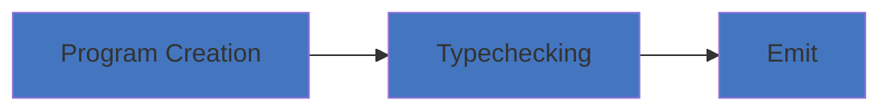
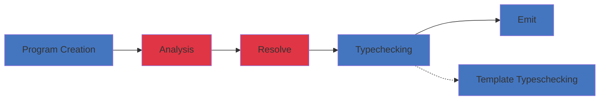

<h1 flex flex-col items-center forward:delay-400 text-transparent text-center important-text-5xl font-800 important-leading-1.2em style="background: -webkit-linear-gradient(315deg,#E43348 25%,#972FF2);-webkit-background-clip: text;">

<br>Angular<br>Deliver web apps with confidence
</h1>

<!--
Wow what an amazing talk by Alex, Pawel & Mark. 
I'm excited for the future of Angular ! 


But for now let's talk about the present.
-->

---
class: flex items-center justify-center
---

<div grid="~ cols-2 gap-10 " mt6>

<!-- <div op50 font-serif italic mb--1>Part I</div> -->
<div w-100 v-click=2 flex="~ col gap-1" p4 rounded bg-violet:15 text-violet1>
  <div text-2xl i-simple-icons:compilerexplorer  text-violet mb2 />
  <div>Angular Compiler</div>
  <!-- <div text-sm op60>オープンソースは贈り物です</div> -->
</div>

<div v-click=1 flex="~ col gap-1" p4 rounded bg-orange:15 text-orange1>
  <div text-2xl i-ph-target-duotone text-orange mb2 />
  <div>Angular Runtime</div>
  <!-- <div text-sm op60>返礼は目的ではない</div> -->
</div>

</div>

<!--
Angular broadly has 2 parts. 

Runtime: the fw code that gets shipped with your app and runs in the browser. 

Compiler: our build time utility


We I started contributing to Angular over 2 years. 
I starting contributing on the runtime part (common, router, core module etc). 

The compiler felt a bit more complex, like a black box. I had vague idea of what it did.

And this brings us on today's topic.
-->

---
layout: cover
title: Compilers
---

<h1 flex="~ col">
<div text-2xl origin-top-left transition duration-500 :class="$clicks <= 2 ? 'scale-150' : 'op50'">
  <span>Angular</span>
  <span v-click>'s great asset </span>
  <sup v-click>❤️</sup>
</div>
<div mt1 forward:delay-300 v-click>The compiler</div>
</h1>

<div abs-br mx-10 mb-35 flex="~ col gap-4 items-end" text-left v-click="1">
  

  <div flex flex-col items-center forward:delay-400 text-transparent text-center important-text-5xl font-800 important-leading-1.2em style="background: -webkit-linear-gradient(315deg,#E43348 25%,#972FF2);-webkit-background-clip: text;">
  Ng Poland
  </div>
  <div text-sm opacity-75 mt--4>Nov. 6th 2024</div>
</div>

<!--

...

[click] ...
-->

---
layout: intro
class: pl-20
glowSeed: 14
---

# Matthieu Riegler

<div class="[&>*]:important-leading-10 opacity-80">

🧑🏼‍💻 Software Engineer<br>
🚂 Random dude who often codes on the train <br>
{Angular} Team / OSS <br>
🤺 Looking for the next challenge<br>

</div>

<div my-10 w-min flex="~ gap-1" items-center justify-center>
  <div i-ri-user-3-line op50 ma text-xl />
  <div><a href="https://riegler.fr" target="_blank" class="border-none! font-300">riegler.fr</a></div>
  <div i-ri-linkedin-line op50 ma text-xl ml4/>
  <div><a href="https://www.linkedin.com/in/matthieuriegler/" target="_blank" class="border-none! font-300">Matthieu&nbsp;Riegler</a></div>
  <div i-ri-github-line op50 ma text-xl ml4/>
  <div><a href="https://github.com/JeanMeche" target="_blank" class="border-none! font-300">JeanMeche</a></div>
  <div i-ri-bluesky-line op50 ma text-xl ml4 />
  <div><a href="https://bsky.app/profile/jeanmeche.com" target="_blank" class="border-none! font-300">jeanmeche.com</a></div>
  <div i-ri-twitter-x-line op50 ma text-xl ml4/>
  <div><a href="https://twitter.com/jean__meche" target="_blank" class="border-none! font-300">jean__meche</a></div>
</div>


<!--
So first, let me introduce myself, my name is Matthieu Riegler.

...
-->


---
layout: center
class: text-center
---

<h1 important-text-5xl>Why does angular have a <br>compiler <span text-yellow2 italic v-mark.yellow.underline.delay300="0">at all</span> ? </h1>

<!--
So the question some of you might be asking...

The main job of the compiler is to turn the template that you write into the code that runs at runtime.
-->

---
class: flex justify-center
---

<div grid="~ cols-2 gap-10 flex items-center" mt6>

<div>
<div op50 font-serif italic mb--1>Template - Declarative</div>
```html
<detail-view [selection]="currentSelection" />
```
</div>

<div>
<div op50 font-serif italic mb--1>Runtime - Imperative</div>

```js 
  // DOM Init
  const el = document.createElement('detail-view');
  const cmp = new DetailViewComponent();

  // Initial rendering
  renderComponent(el, cmp);

  // run Change Detection
  if(ctx.selection !== oldSelection) {
    // Binding has changed, need to update 
    cmp.selection = ctx.selection
    oldSelection = cmp.selection
    ng.updateView(el, cmp);
  }
```
</div>
</div>

<!--
In Angular you write you templates declaratively (HTML-like)
You specify the components you want to render, the bindings you want to check. 

Browsers do not understand declarative angular template syntax.
-->

---
layout: center
---

<div>
<p mb-8 font-size-6>The Angular compiler takes declarative syntax</p>

```js 
@Injectable({...})
class MyService {}

@Component({
  template: `<button> [tooltip]="'Open the panel'"></button>`
})
class FooComponent{}
```

<p font-size-6>and converts it to declarative code</p>
</div>

<!--
We need to transform into something the browser understands
-->

---

<div grid="~ cols-2 gap-10 flex items-center" mt6>

<div>
<div op50 font-serif italic mb--1>Template - Declarative</div>

```html
<div>Hello World</div>

<router-outlet />

<my-child-component [input]="value" />
```
</div>


<div>
<div op50 font-serif italic mb--1 v-click=1>Compiled component - Imperative</div>

```js {hide|all|8-20|10-14,17,18}
class TestCmp { 
  static ɵcmp = ɵɵdefineComponent({
    type: TestCmp,
    selectors: [['test-cmp']],
    decls: 4,
    vars: 1,
    consts: [[3, 'input']],
    template: function TestCmp_Template(rf, ctx) {
      if (rf & 1) {
        ɵɵelementStart(0, 'div');
        ɵɵtext(1, 'Hello World');
        ɵɵelementEnd();
        ɵɵelement(2, 'router-outlet')
                 (3, 'my-child-component', 0);
      }
      if (rf & 2) {
        ɵɵadvance(3);
        ɵɵproperty('input', ctx.value);
      }
    },
    encapsulation: 2,
  });
}
```
</div>
</div>

---
class:
---

<div transition duration-800 :class="$clicks < 1 ? 'translate-y-45' : ''" relative>

<h1 relative text-center>
Leveraging the <span font-hand text-pink-500 scale-110 ml1 inline-block>Compiler !</span>
<!-- <span v-mark.linethrough.red.delay200="{at:1,roughness:6,seed:146}" transition inline-block :class="$clicks >= 1 ? 'op50' : ''"> Good</span> -->
</h1>

<!-- <div font-hand bold absolute rotate--4 left-106 top-10 text-3xl text-lime1 delay-300 v-click>General & Useful</div> -->

</div>

<div top-25 relative transition duration-400 forward:delay-600 v-click="1">

<div grid="~ cols-3 gap-10 " mt6 font-size-8>
  <div v-click=1 flex="~ col gap-1" p4 h-40 rounded bg-red:15 text-red1>
    <div i-material-symbols-light:rocket-launch-rounded w-1em h-1em text-red></div>
    <div>Features</div>
    <div text-sm op60>Real features !</div>
  </div>

  <div v-click=2 flex="~ col gap-1" p4 rounded bg-pink:15 text-pink1>
    <div text-2xl i-ph-target-duotone text-pink mb2 />
    <div>Optimizations</div>
    <div text-sm op60>bundle size, runtime</div>
  </div>

  <div v-click=3 flex="~ col gap-1" p4 rounded bg-violet:15 text-violet1>
    <div text-2xl i-iconoir:developer text-violet mb2 />
    <div>DX</div>
    <div text-sm op60>For your sanity</div> 
  </div>
</div>

</div>

<!--
Angular relies on its compiler 

- to provide features
- enable some optimisations
- Improve DX
-->

---
layout: center
class: text-center
---

<h1 important-text-5xl>Features</h1>

---
glow: bottom
title: Control flow syntax
---

# Control flow syntax <sup text-pink bg-pink:15 px1.5 rounded text-sm>Feature</sup> <sup text-pink bg-pink:15 px1.5 rounded text-sm v-click=3>Optimization</sup> <sup v-click=4 text-pink bg-pink:15 px1.5 rounded text-sm>DX</sup>

<div grid="~ cols-2 gap-10 " mt6 font-size-8>

<div>

```angular-html 
@if(shouldDisplay()) {
    <my-details />
}

@for(item of list; track $index) {
   <my-item [item]="item" />
}

@switch(someValue) {
  @case a: ...
  @case b: ...
}
```

<ul font-size-6 pt-4>
  <li v-click=3>No structural directive execution</li>
  <li v-click=4>No additional imports</li>
</ul>

</div>


```js {hide|all|3-12,15-17}
function TestCmp_Template(rf, ctx) {
    if (rf & 1) {
      ɵɵtemplate(0, TestCmp_Conditional_0_Template, 1, 0, 'my-details');
      ɵɵrepeaterCreate(
        1,
        TestCmp_For_2_Template,
        1,
        1,
        'my-item',
        0,
        ɵɵrepeaterTrackByIndex,
      );
    }
    if (rf & 2) {
      ɵɵconditional(ctx.shouldDisplay() ? 0 : -1);
      ɵɵadvance();
      ɵɵrepeater(ctx.list);
    }
}
```


</div>

<!--
<div text-white:50 relative v-click="2">
The <span v-mark.box.teal.delay400="2" text-teal mx1>"Stairs"</span> to make things easier to approach
</div>
-->

---
class: flex flex-col
title: \@let
glow: right
---

# @let template variable declarations

<div grid="~ cols-2 gap-10 " mt6>


```angular-ts {all|4-7}

@Component({
  selector: 'app-root',
  template: `
      @let myState = this.myState();
      @if(myState) {
        <div>{{myState.foo}}</div>
      } 
  `,
})
export class AppComponent {
  myState!: Signal<{foo: string} | undefined>;
}

```

```js {all|3,4,7-9}{at:1}
template: function AppComponent_Template(rf, ctx) {
    if (rf & 1) {
        ɵɵdeclareLet(0);
        ɵɵtemplate(1, AppComponent_Conditional_1_Template, 2, 1, "div");
    }
    if (rf & 2) {
        const myState_r2 = ɵɵstoreLet(ctx.myState());
        ɵɵadvance();
        ɵɵconditional(myState_r2 ? 1 : -1);
    }
},
```

</div>


---
class: flex flex-col
title: Defer blocks
glow: right
---

# Deferable views

<!-- <div flex flex-1 items-center justify-center> -->
<div flex="~ gap-2" text-indigo >

<div flex-1>

````md magic-move
```html  {all|all|all}
<app-foo-cmp/>
```
```angular-html
@defer (on immediate) {
  <app-foo-cmp/>
}  
```

```angular-ts {all|1}
import {FooComponent} from './foo.component'

@Component({
  ...
  imports: [FooComponent]
  template: `
    @defer (on immediate) {
      <app-foo-cmp/>
    }  
})

```
````
</div>

<div flex-2>

````md magic-move {at:1}
```js {hide|all|9|hide|hide}
var AppComponent = class _AppComponent {
  static ɵcmp = ɵɵdefineComponent({
      ...
      template: function AppComponent_Template(rf, ctx) {
          if (rf & 1) {
              ɵɵelement(0, "app-foo");
          }
      },
      dependencies: [FooComponent],
  });
}

```
```js {all|1-3,16-18}
var AppComponent_Defer_1_DepsFn = () => [
  import("/chunk-PS3LC6HF.js").then( (m) => m.FooComponent)
];

function AppComponent_Defer_0_Template(rf, ctx) {
    if (rf & 1) {
        ɵɵelement(0, "app-foo");
    }
}

var AppComponent = class _AppComponent {
  static ɵcmp = ɵɵdefineComponent({
    ...
    template: function AppComponent_Template(rf, ctx) {
      if (rf & 1) {
          ɵɵtemplate(0, AppComponent_Defer_0_Template, 1, 0);
          ɵɵdefer(1, 0, AppComponent_Defer_1_DepsFn);
          ɵɵdeferOnIdle();
      }
    },
  });
}
```
````

</div>

</div>


---
class: flex flex-col
title: Incremental Hydration
---

# Incremental Hydration

<div flex="~ gap-2" text-indigo >

<div flex-1>

````md magic-move
```angular-html
@defer (on immediate; hydrate on interaction){
  <app-foo />
}
```

```angular-ts {all|1}
import {FooComponent} from './foo.component'

@Component({
  ...
  imports: [FooComponent]
  template: `
    @defer (on immediate; hydrate on interaction){
      <app-foo />
    }
  ` 
})

```
````
</div>

<div flex-2>

````md magic-move {at:1}
```js {hide|all|1-3,16-19}
var AppComponent_Defer_1_DepsFn = () => [
  import("/chunk-PS3LC6HF.js").then( (m) => m.FooComponent)
];

function AppComponent_Defer_0_Template(rf, ctx) {
    if (rf & 1) {
        ɵɵelement(0, "app-foo");
    }
}

var AppComponent = class _AppComponent {
  static ɵcmp = ɵɵdefineComponent({
    ..
    template: function AppComponent_Template(rf, ctx) {
        if (rf & 1) {
          ɵɵtemplate(0, AppComponent_Defer_0_Template, 1, 0);
          ɵɵdefer(1, 0, AppComponent_Defer_1_DepsFn);
          ɵɵdeferHydrateOnInteraction();
          ɵɵdeferOnImmediate();
        }
    },
  });
}
```
````

</div>

</div>

---
class: flex flex-col
title: Quick Demo
layout: cover
---

<iframe src="https://jeanmeche.github.io/angular-compiler-output/" height="500" width="800"/>

---
glow: bottom
title: Control flow syntax
---

# Input/Output <sup text-pink bg-pink:15 px1.5 rounded text-sm>Feature</sup> <sup v-click text-pink bg-pink:15 px1.5 rounded text-sm>DX</sup>

<div grid="~ cols-2 gap-10 " mt6 font-size-8>

<div>

```angular-ts
class FooComponent {
  foo = input.required<string>();
  @Input() bar!: string;

  cancelled = output();
  @Output() submitted = new EventEmitter();
}
```

<!-- <ul font-size-6 pt-4>
  <li v-click=3>No structural directive execution</li>
  <li v-click=4>No additional imports</li>
</ul> -->

</div>

```js 
class FooComponent {
  ...
  static ɵcmp = ɵɵdefineComponent({
    ...
    inputs: { foo: [1, "foo"], bar: "bar" },
    outputs: { cancelled: "cancelled", submitted: "submitted" },
  });
};
```

</div>

---
class: flex flex-col
title: DI System
---

# Dependency injection sytem

<div grid="~ cols-2 gap-10 " mt6>

```angular-ts 
@Injectable({providedIn: 'root'})  
class MyService {

  constructor(fooService: FooService) {}
}
```

```js
class _MyService {
    constructor(fooService) {}
    static ɵfac = function MyService_Factory(__ngFactoryType__) {
        return new (__ngFactoryType__ || _MyService)(ɵɵinject(FooService));
    }
    ;
    static ɵprov = /* @__PURE__ */
    ɵɵdefineInjectable({
        token: _MyService,
        factory: _MyService.ɵfac,
        providedIn: "root"
    });
}
```

</div>

---
layout: center
glow: center
---

<h1 important-text-5xl><span transition duration-700 inline-block :class="$clicks === 0 ? 'translate-x-40' : ''">Optimizations</span> <span forward:delay-400 v-click>under the hood</span></h1>

<div text-2xl op75 font-jp v-after forward:delay-800>Runtime & bundle size</div>

---
glowX: 0
glowY: 0
class: text-2xl
---

# Optimizations

Bundle sizes 

* Feature oriented instructions 

* Enables efficient tree-shaking

<div
  v-click="1"
  absolute w-150 h-150 right--20 border="~ gray/50 rounded-full" bg-gray:20 text-5xl top-20 
  flex="~ items-center justify-center"
  transition-all duration-500 pt-50
>
  Set of features
  <div
    v-click="2"
    absolute w-70 h-70 left-40 top-5 border="~ red rounded-full"
    bg-red:20 text-4xl text-red flex="~ items-center justify-center" text-center
    transition-all duration-500 p-5
  > Tree-shaking the
    unused ones 

  </div>
</div>

---
glowX: 0
glowY: 0
class: text-2xl
---

# Optimizations

Optimizations under the hood  

* Angular takes care of the imperative implementation

* Browser APIs evolve

* Angular evolves to keep up with how browsers behave 


---
layout: center
glow: center
---

<h1 important-text-5xl><span transition duration-700 inline-block :class="$clicks === 0 ? 'translate-x-40' : ''">DX</span> <span forward:delay-400 v-click>& typesafety</span></h1>

<div text-2xl op75 font-jp v-after forward:delay-800>
Angular 🤝 Typescript
</div>

---
class:
---

# Basic Compiler architecture

<div mt-5 mb-20 v-click>
<h2 mb-2> Typescript Architecture</h2>

</div>

<div v-click>
<h2 mb-2> Angular Architecture</h2>


</div>

---
class:
---

# Type Check Blocks 

<ul>
  <li>TSC doesn't support compiling/typechecking HTML</li>
  <li>Transform templates into blocks of TS code (TCB)</li>
  <li>TCBs are not emited</li>
  <li>Allow type errors that directly reference the template</li>
</ul>

<div v-click>

```angular-ts 
<app-foo [numberInput]="someString">


// ✘ [ERROR] NG2: Type 'string' is not assignable to type 'number'. [plugin angular-compiler]
//
//    src/app/app.component.html:12:10:
//      12 │ <app-foo [numberInput]="someString">
//         ╵           ~~~~~~~~~~~
```
</div>

---
class:
---

# Migration schematics

The migration schematics can leverage the compiler 

<ul>
  <li>Signal migrations (input, queries)</li>
  <li><code>output()</code> migrations</li>
</ul>

---
class: 
layout: intro
---

# Compiler

<ul>
<li> <span text-pink font-bold v-mark.highlight.pink.op5.delay200="1" inline-block p3 mx--2>awesome</span>, bring bringing better performances</li>
<li>Is your <span text-lime2 italic v-mark.yellow.underline.delay300="2">friend</span>, by providing better DX</li>
<li><span v-mark.orange.circle.delay300="3">Mostely invisible</span>, but alaways has your back</li>
<li>Is Angular's greatest asset ❤️</li>
</ul>

---
class:
title: See also
---

# See also

<div grid cols-2 gap-10>
  <div>
  <a href="https://www.youtube.com/watch?v=anphffaCZrQ"></a>
  <div op50 font-serif italic mb--1>Alex Rickabaugh's deep dive into the compiler <br>@ Angular Connect 2019</div>

  </div>

  <div>
  <a href="https://www.youtube.com/watch?v=S0o-4yc2n-8"></a>
  <div op50 font-serif italic mb--1>Kara Erickson's How Angular works <br>@ Angular Connect 2019</div>
  </div>
</div>

---
layout: intro
class: text-center pb-5
---

# Thank you!

Slides on [riegler.com](https://riegler.com)

<!--
That's all for my talk, thank you. Please enjoy the rest of the conference :)
-->
