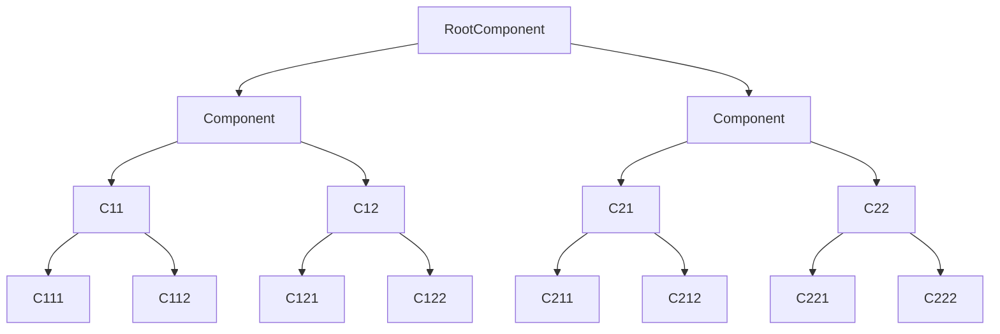
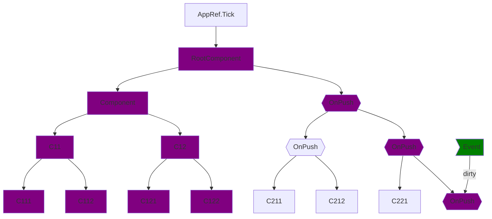
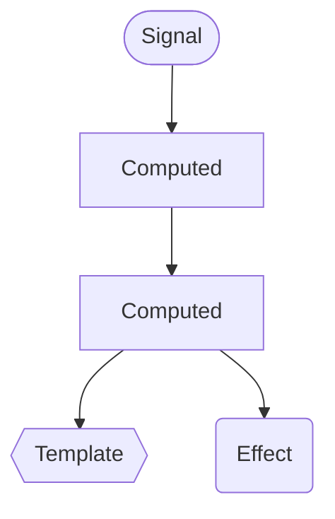
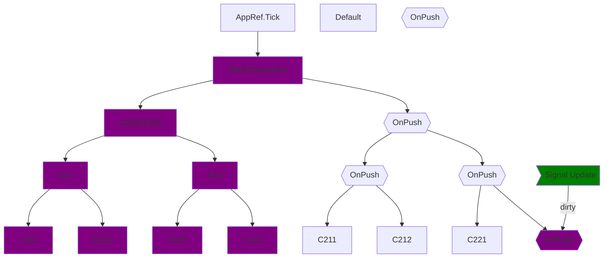

<h1 flex flex-col items-center forward:delay-400 text-transparent text-center important-text-5xl font-800 important-leading-1.2em style="background: -webkit-linear-gradient(315deg,#E43348 25%,#972FF2);-webkit-background-clip: text;">

<br>Angular<br>Deliver web apps with confidence
</h1>


---
layout: cover
title: Compilers
--- 

<h1 flex="~ col">
<div text-2xl origin-top-left transition duration-500 :class="$clicks <= 2 ? 'scale-150' : 'op50'">
  <span>Angular</span>
  <span v-click> & signals </span>
  <sup v-click>❤️</sup>
</div>
<div mt1 forward:delay-300 v-click>Modern Reactivity</div>
</h1>

<div abs-br mx-10 mb-35 flex="~ col gap-4 items-end" text-left v-click="1">
  

  <div flex flex-col items-center forward:delay-400 text-transparent text-center important-text-5xl font-800 important-leading-1.2em style="background: -webkit-linear-gradient(315deg,#E43348 25%,#972FF2);-webkit-background-clip: text;">
  iJS Munich
  </div>
  <div text-sm opacity-75 mt--4>Nov. 14th 2024</div>
</div>

---
layout: cover
---

<div grid cols-3 gap-10>
<div v-click>

# Past
</div>
<div v-click>

# Present
</div>
<div v-click>

# Future
</div>

</div>
<div mt-20 text-center>

# Reactivity
</div>


---
layout: intro
class: pl-20
glowSeed: 14
---

# Defining Reactivity

---
layout: intro
class: pl-20
glowSeed: 14
---

# Reactive Programming (RxJS)

* Event based 
* Stream of Events
* Order & Time sensitive
* Each individual event that passes through the pipe is processed

---
layout: intro
class: pl-20
glowSeed: 14
---

# Framework reactivity
<h3 v-click> Render the view when the model is updated</h3>
  

---}
layout: intro
class: pl-20
glowSeed: 14
---

# Matthieu Riegler

<div class="[&>*]:important-leading-10 opacity-80">

🇫🇷 / 🇩🇪
🧑🏼‍💻 Software Engineer<br>
{Angular} Team / OSS <br>

</div>

<div my-10 w-min flex="~ gap-1" items-center justify-center>
  <div i-ri-user-3-line op50 ma text-xl />
  <div><a href="https://riegler.fr" target="_blank" class="border-none! font-300">riegler.fr</a></div>
  <div i-ri-linkedin-line op50 ma text-xl ml4/>
  <div><a href="https://www.linkedin.com/in/matthieuriegler/" target="_blank" class="border-none! font-300">Matthieu&nbsp;Riegler</a></div>
  <div i-ri-github-line op50 ma text-xl ml4/>
  <div><a href="https://github.com/JeanMeche" target="_blank" class="border-none! font-300">JeanMeche</a></div>
  <div i-ri-bluesky-line op50 ma text-xl ml4 />
  <div><a href="https://bsky.app/profile/jeanmeche.com" target="_blank" class="border-none! font-300">jeanmeche.com</a></div>
  <div i-ri-twitter-x-line op50 ma text-xl ml4/>
  <div><a href="https://twitter.com/jean__meche" target="_blank" class="border-none! font-300">jean__meche</a></div>
</div>


<!--
So first, let me introduce myself, my name is Matthieu Riegler.

...
-->


  

---}
layout: center
class: text-center
---

<h1 important-text-5xl>How does <br>Angular <span text-pink italic v-mark.pink.underline.delay300="0">refresh views</span> ? </h1>

<!--
So the question some of you might be asking...

The main job of the compiler is to turn the template that you write into the code that runs at runtime.
-->

---
class:
---

# Change detection 
Component Tree



<!--
Change detection is the process through which Angular checks to see whether your application state has changed, and if any DOM needs to be updated.
-->

---
class:
---

## What's actually an update ?

<div grid="~ cols-2 gap-10 " mt6 font-size-8>

  <div>

```angular-html 
@if(shouldDisplay()) {
    <my-details />
}

@for(item of list; track $index) {
   <my-item [item]="item" />
}

@switch(someValue) {
  @case a: ...
  @case b: ...
}
```

<ul font-size-6 pt-4>
  <li v-click=3>Creation Mode</li>
  <li v-click=4>Update Mode</li>
</ul>

</div>


```js {hide|all|3-12,15-17}
function TestCmp_Template(rf, ctx) {
    if (rf & 1) {
      ɵɵtemplate(0, TestCmp_Conditional_0_Template, 1, 0, 'my-details');
      ɵɵrepeaterCreate(
        1,
        TestCmp_For_2_Template,
        1,
        1,
        'my-item',
        0,
        ɵɵrepeaterTrackByIndex,
      );
    }
    if (rf & 2) {
      ɵɵconditional(ctx.shouldDisplay() ? 0 : -1);
      ɵɵadvance();
      ɵɵrepeater(ctx.list);
    }
}
```
</div>

---
layout: cover
---

# Demo


---
title: Quick Demo
class: p-1
---

<iframe src="https://jeanmeche.github.io/angular-compiler-output/" height="500" width="100%"/>

<pre><a href="https://jeanmeche.github.io/angular-compiler-output/">jeanmeche.github.io/angular-compiler-output/</a></pre>


---
layout: center
class: text-center
---

<h1 important-text-5xl>How does Angular<br> <span text-pink italic v-mark.pink.underline.delay300="0">schedule</span> change detection ? </h1>


---
class:
title: Zone.js
---

<div transition duration-800 :class="$clicks < 2 ? 'translate-y-45' : ''" relative>

<h1 class="text-center"> Zone.js</h1>
<div font-hand bold absolute rotate--4 left-106 top-10 text-3xl text-lime1 delay-300 v-click>An execution context</div>
</div>

<div top-15 relative transition duration-400 forward:delay-600 v-click="2">
  <ul class="text-2xl">
    <li>Patches asynchronous APIs</li>
    <li>Angular is notified when one of those APIs are invoked</li>
    <li>Angular <span text-pink italic v-mark.pink.underline.delay300="0">schedules</span> Change Detection</li>

  </ul>
</div>


---
class:
---

# Change detection 
Component Tree


---
class:
---

# Optimisations 
<code>ChangeDetectionStrategy.OnPush</code>



--- 
class:
---

<div transition duration-800 :class="$clicks < 2 ? 'translate-y-45' : ''" relative>
<h1 text-center text-4xl>Zoneless</h1>
</div>

<div relative transition duration-400 forward:delay-600 v-click="2" text-center text-4xl>
  What are you talking about ?
</div>

<div relative top-20 transition duration-400 forward:delay-600 v-click="3" text-4xl>
  <div>A question of <span text-pink6>when</span></div>
  <br>
  <div>Zone.js is Angular's <span text-purple>scheduler</span></div>
</div>

--- 
class:
layout: center
---

<h1 text-4xl> Downsides of Zone.js</h1>
<div text-2xl>

* 30 kB, eagerly loaded
* Zones, async runtime context
* Messy stack traces
* No support for native async/await
</div>

--- 
class:
layout: cover
---

<div transition duration-800 :class="$clicks < 1 ? 'translate-y-45' : ''" relative>
  <h1 text-center text-4xl>How do we replace zone.js ?</h1>
</div>

<div relative transition duration-400 forward:delay-600 v-click="1" text-center text-4xl>
  A new <span text-pink-400>scheduler</span>
</div>


<div top-20 relative transition duration-400 forward:delay-200 v-click="2" text-center text-4xl>
  <div>rAF-race</div>
  <code>setTimeout()</code> + <code>requestAnimationFrame()</code>
</div>

--- 
layout: center
---

# Scheduler triggers 

* AsyncPipe (`markForCheck`)
* Template Event Listeners 
* Signals


--- 
class:
layout: center
---

# Enable zoneless

```angular-ts 
bootstrapApplication(AppComponent, {
  providers: [
    // Experimental provider in v18/v19 
    provideExperimentalZonelessChangeDetection()
  ]
})
```

--- 
class:
layout: cover
---

<h1>Modern reactivity</h1>
<h1 v-click>Signals 📡</h1>

---
class:
layout: cover
---

# Angular Signals 

* Wrapper around a value (primitive or complex structure)
* Granularly tracks state changes 

```ts
const counter = signal(0);

function reset() {
  counter.set(0); 
}

function increment() {
  counter.update(value => value +1);
}
```


<!--
Signals can contain any value, from primitives to complex data structures.
-->

--- 
class:
---

# A Dependency tree

The signals implementation is defined in terms of two abstractions. 

* Producers 
* Consumers

## Producers 

Represent values which can deliver change notifications. 

## Consumers
Represent a reactive context which may depend on some number of producers.

---
class:
layout: cover
---

<h1>Producers <span text-pink font-bold v-mark.highlight.pink.op5.delay200="1" inline-block p3 mx--2>produce</span> reactivity,</h1> 
<h1>Consumers <span text-yellow font-bold v-mark.highlight.yellow.op5.delay200="1" inline-block p3 mx--2>consume</span> it</h1>

<!-- In other words... -->


--- 
class:
layout: cover
---

# Consuming & deriving state 

```ts
// A kind of producer 
counter = signal(0);

// Another kind of producer, derived from the previous one
doubleCounter = computed(() => counter() * 2);
```

Note that the dependency are implicit. 

```ts
doubleCounter = computed(() => {
  if(true) {
    counter() * 2
  } else {
    // never consumed
    someOtherSignal()
  }
});
```

--- 
class:
layout: cover
---

# Component templates 

<div flex>
```angular-html 
<section>
  value:  {{ counter() }}
  double value:  {{ doubleCounter() }}
</section>
```
</div>


---
class:
---

# Linking the reactive word 

```ts 
effect(() => {
  const state = chartState();

  myChartLib.set(state);
})
```

`effect` is how you link reactive things to non-reactive things.

---
class: text-center
---

# A reactive tree



---
class:
layout: cover
---

# Angular understands <br/>the signal graph

---
class:
---


# Local Change Detection 
Powered by signals



---
layout: cover
---

# Demo


---
title: Quick Demo
class: p-1
---

<iframe src="https://jeanmeche.github.io/angular-change-detection/" height="500" width="100%"/>

<pre><a href="https://jeanmeche.github.io/angular-change-detection/">jeanmeche.github.io/angular-change-detection/</a></pre>


--- 
class:
layout: cover
---

# Root effect / View Effect

--- 
class:
---
# Root effect 

<section>

* top-level effects within an application
* independent from component updates
* runs on `ApplicatinRef.tick()`

```angular-ts
@Injectable()
class MyStateService {
  constructo() {
    effect(() => { /* ... */ })
  }
}
```
<br>

## Usecases  
* Propagating state changes (when computeds are not an option).
* Synchronizing state with the backend or some local storage
* Rendering not tied to a component
* Logging/Debugging

<!--  
 Rendering not tied to a component  (e.g. integration w/ other frameworks)
 -->

</section>

---
class:
---

# View Effect


* Components depend on inputs
* `effect()` can affect component/child state

```ts
const show = computed(() => !!cond());
let view;
effect(() => {
  if (show()) {
    view = this.vcr.createEmbeddedView(this.childView);
  } else {
    view.destroy();
  }
});
```

Important to execute the effect ahead of the component CD. 

<!-- 
Now imagine this effect runs after change detection. This would have 2 major consequences :

If a child view is created, it would have to schedule a new Change detection cycle, which would be inefficient
If the cond become false (and consequently show also), the embedded view would get change detected before being destroyed. This will result in a violation of the invariant that the effect is trying to enforce, and the embedded view will be change detected with a null value it was not written to handle.
In other words, effects that affect the rendering of their children must run before those children undergo change detection. Failing to do so can lead to broken invariants and crashes, as well as inefficiency. View effects ensure this guarantee. For this reasons view effect will run during change detection at the begining of each component check.
-->

---
class:
---

# afterRenderEffect() <sup text-pink bg-pink:15 px1.5 rounded text-sm>Experimental</sup>

Effect x  DOM Access hook. 


```ts
afterRenderEffect({
  earlyRead: () => ...,
  write: () => ...,
  mixedReadWrite: () => ..,
  read: () => ...,
});
```

Designed to access DOM after Angular rendered and updated it.

---
class:
---

# Error handling 
`effect()` are part of CD, they throw on top. 


```ts
it('should throw error...', () => {
  // create an effect that throws
  const appRef = TestBed.inject(ApplicationRef);
  effect(
    () => {
      throw new Error('fail!');
    },
    {injector: appRef.injector},
  );

  // explicitly run the CD and check for the thrown exception
  expect(() => appRef.tick()).toThrowError('fail!');
});

```

--- 
class:
---

# Effect test with `ErrorHandler`

```ts
it('should throw error...', () => {
  let lastError: any = null;
  class FakeErrorHandler extends ErrorHandler {
    override handleError(error: any): void {
      lastError = error;
    }
  }

  TestBed.configureTestingModule({
    providers: [{provide: ErrorHandler, useFactory: () => new FakeErrorHandler()}],
    // we make sure to prevent tick() from throwing.
    rethrowApplicationErrors: false,
  });

  // create an effect that throws
  const appRef = TestBed.inject(ApplicationRef);
  effect(
    () => { throw new Error('fail!'); },
    {injector: appRef.injector},
  );

  // explictly run the CD
  appRef.tick();
  expect(lastError.message).toBe('fail!');
});
```


---
layout: cover
---

# Future of reactivity

--- 
class:
---

# linkedSignal  <sup text-pink bg-pink:15 px1.5 rounded text-sm>Experimental</sup>

A writable, derived & locale state

```ts 
import { Component, linkedSignal, signal } from '@angular/core';

@Component({
  template: `<p>First book in list: {{ firstBook() }}</p>`
})
export class BookListComponent {
  books = input<string[]>();

  firstBook = linkedSignal({
    source: this.books,
    computation: books => books[0]
  });
  
  // this also works (shorthand notation)
  // firstBook = linkedSignal(() => this.books()[0]);

  overrideFirstBook() {
    this.firstBook.set('jQuery');
  }
}
```

---
class:
---

# Resource <sup text-pink bg-pink:15 px1.5 rounded text-sm>Experimental</sup>

Asynchronous resource loading using Signals

```ts 
bookResource = resource({
  request: () => selectedBookId()
  loader: (param) => bookService.getBook(param.request)
})
```

The loader is triggered every time the request dependencies change. 

```ts
// reloading
bookResource.reload() 

// set a local state
bookResource.set({ /** bookObject */})

bookResource.hasValue()
bookResource.isLoading() // 
bookResource.asReadonly()
```


---
class:
---

# Forms  <sup text-pink bg-pink:15 px1.5 rounded text-sm>Prototyping stage</sup>
Prototype 🧪

```angular-ts

@Component({
  template: `
    <input [field]="form.field.firstName" />
    <input [field]="form.field.lastName" />
  `
})
class UserProfile {
  data = signal({firstName: 'Matt', lastName: 'Riegler'})

  // Form is derived from data
  form = autoForm(this.data)
}
```

Powered by signal, unified, flexible and interoperable

--- 
class: 
---

# Router  <sup text-pink bg-pink:15 px1.5 rounded text-sm>Brainstorming stage</sup>
Prototype 🧪

Router coordinates data fetching

Rendering becomes synchronous

Resource API ties them together

--- 
layout: cover
--- 

# Signals for everyone  

<div flex>
 <div flex-1>TC39 proposal to land Signals into the platform</div> 
</div>

<pre><a href="https://github.com/tc39/proposal-signals">github.com/tc39/proposal-signals</a></pre>

---
layout: intro
class: text-center pb-5
---

# Thank you!

Slides on [riegler.com](https://riegler.com)

<!--
That's all for my talk, thank you. Please enjoy the rest of the conference :)
-->
