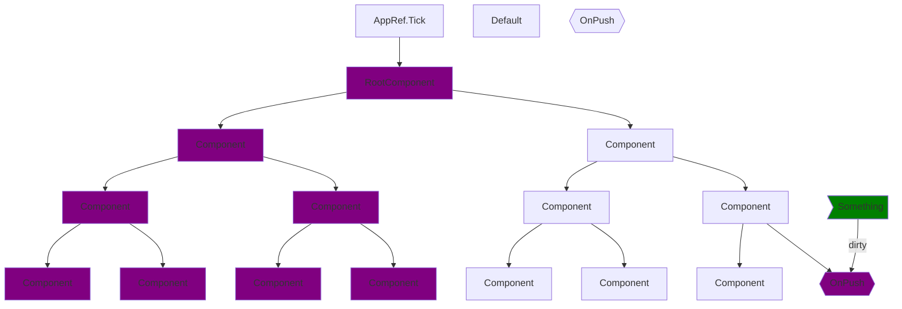
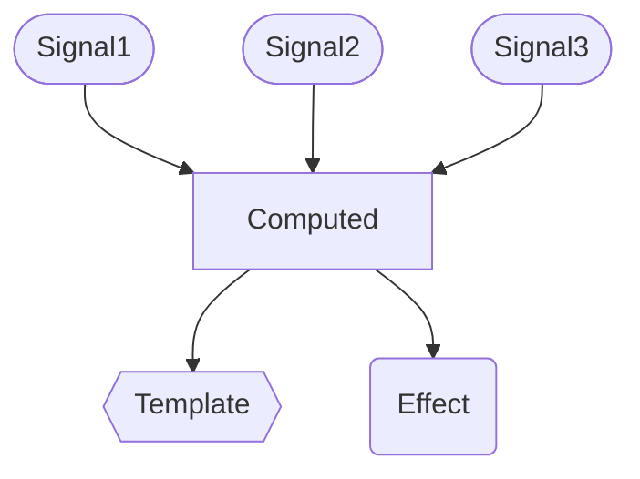
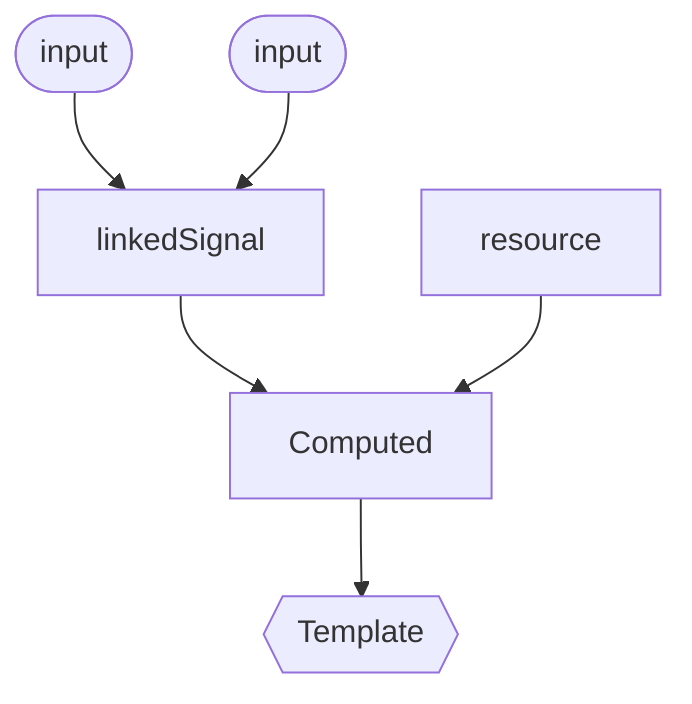

<h1 flex flex-col items-center forward:delay-400 text-transparent text-center important-text-5xl font-800 important-leading-1.2em style="background: -webkit-linear-gradient(315deg,#E43348 25%,#972FF2);-webkit-background-clip: text;">

<br>Angular<br>Deliver web apps with confidence
</h1>

---
layout: cover
---

# Once upon a time

---
layout: cover
title: Pull Based
---

<h1 flex="~ col">
<div text-2xl origin-top-left transition duration-500 :class="$clicks <= 2 ? 'scale-150' : 'op50'">
  <span v-click>with </span>
  <span>Angular</span>
  <sup v-click>❤️</sup>
</div>
<div mt1 forward:delay-300 v-click>Pull Based</div>
</h1>

<div abs-br mx-10 mb-35 flex="~ col gap-4 items-end" text-left v-click="1">
  

  <div flex flex-col items-center forward:delay-400 text-transparent text-center important-text-5xl font-800 important-leading-1.2em style="background: -webkit-linear-gradient(315deg,#FA2C04 25%,#F3B41E);-webkit-background-clip: text;">
  NG BE
  </div>
  <div text-sm opacity-75 mt--4>Dec. 6th 2024</div>
</div>

<!--

...

[click] ...
-->

---
layout: intro
class: pl-20
glowSeed: 14
---

# Matthieu Riegler

<div class="[&>*]:important-leading-10 opacity-80">

🧑🏼‍💻 Software Engineer<br>
🚂 Random dude who often codes on the train <br>
{Angular} Team / OSS <br>
🤺 Looking for the next challenge<br>

</div>

<div my-10 w-min flex="~ gap-1" items-center justify-center>
  <div i-ri-user-3-line op50 ma text-xl />
  <div><a href="https://riegler.fr" target="_blank" class="border-none! font-300">riegler.fr</a></div>
  <div i-ri-linkedin-line op50 ma text-xl ml4/>
  <div><a href="https://www.linkedin.com/in/matthieuriegler/" target="_blank" class="border-none! font-300">Matthieu&nbsp;Riegler</a></div>
  <div i-ri-github-line op50 ma text-xl ml4/>
  <div><a href="https://github.com/JeanMeche" target="_blank" class="border-none! font-300">JeanMeche</a></div>
  <div i-ri-bluesky-line op50 ma text-xl ml4 />
  <div><a href="https://bsky.app/profile/jeanmeche.com" target="_blank" class="border-none! font-300">jeanmeche.com</a></div>
  <div i-ri-twitter-x-line op50 ma text-xl ml4/>
  <div><a href="https://twitter.com/jean__meche" target="_blank" class="border-none! font-300">jean__meche</a></div>
</div>


<!--
So first, let me introduce myself, my name is Matthieu Riegler.

...
-->

---
layout: center
---

# Observables <span v-click=2> are <span v-mark.purple.underline=3 text-purple italic>async</span> !</span>

````md magic-move
```ts
myObservable.subscribe(console.log)
```
```ts
myObservable.subscribe(console.log)

// Doesn't log synchronously (could in some cases)
```
````

---
layout: center
---

# Observables <span v-click=4> are actually <span v-mark.yellow.underline=5 text-yellow italic>synchronous</span></span>

````md magic-move
```ts
const subject = new Subject<number>();
subject.subscribe(console.log);
```
```ts
const subject = new Subject<number>();
subject.subscribe(console.log);

subject.next(42);

console.log('foobar');
```
```ts
const subject = new Subject<number>();
subject.subscribe(console.log);

subject.next(42);
// synchronously logs 42

console.log('foobar');
```
````

---
layout: center
---


---
layout: center
---

# Signals <span v-click=2> are <span v-mark.purple.underline=3 text-purple italic>synchronous</span> !</span>

````md magic-move
```ts
const mySignal = signal(42)

console.log(mySignal())
```
```ts
const mySignal = signal(42)

console.log(mySignal())
// synchronously logs 42
```
````

---
layout: center
---

# Signals <span v-click=2> are also <span v-mark.red.underline=3 text-red italic>async</span> !</span>

````md magic-move
```ts
const mySignal = signal(0);
effect(() => console.log(mySignal()));

mySignal.set(42);
console.log('before');
```
```ts
const mySignal = signal(0);
effect(() => console.log(mySignal()));

mySignal.set(42);
console.log('before');
// logs "before" then "42"
```
````

---
layout: center
---

<div text-4xl origin-left-top class="[&_td]:p8 [&_th]:p8">

 |                          |                Signals                 |              Observables               |
 | :----------------------- | :------------------------------------: | :------------------------------------: |
 | <div>Read</div>  |  <div v-click=1 text-green>Sync</div>  | <div v-click=3 text-purple>Async</div> |
 | <div>Write</div> | <div v-click=4 text-purple>Async</div> |  <div v-click=2 text-green>Sync</div>  |

</div>

---
layout: cover
---

# About Change Detection

---
class:
---

# Change detection

<div pb-12></div>



---
layout: center
class:
---

# `Observable` based Triggers

* `AsyncPipe`
* `RxPush` from RxAngular
* `PushPipe` from NgRx

<br><br>
# `subscribe()` to the Observables

---
class:
---

# Templates and observables

````md magic-move
```angular-ts
@Component({
  template: `
    @if(viewModel$ | async; as viewModel) {
      <div>{{ viewModel.someProp }}</div>
    }`
  ...
})
class MyComponent {
  viewModel$ = combineLatest({
    someProp: someService.someValue$,
    someOther: someService.someOtherValue$,
    ...
  })
}
```
```angular-ts
@Component({
  imports: [AsyncPipe],
  template: `
    @if(viewModel$ | async; as viewModel) {
      <!-- async is an implicit subscription -->
      <div>{{ viewModel.someProp }}</div>
    }`
  ...
})
class MyComponent {
  viewModel$ = combineLatest({
    someProp: someService.someValue$,
    someOther: someService.someOtherValue$,
    ...
  })
  // updated everytime one of the observables is updated.
}
```
````

---
class:
---

# It can get worse.

```angular-ts
@Component({
  imports: [AsyncPipe],
  template: `
    @if(viewModel$ | async; as viewModel) {
      <div>{{ viewModel.someProp }}</div>
    }`
  ...
})
class MyComponent {
  viewModel$ = combineLatest({
    someProp: someService.someValue$,
    someOther: someService.someOtherValue$,
    // imagine this observable doesn't emit
    someStream: someService.aSubject$
    ...
  })
}
```
<h1 pt-4 v-click>Your component <span v-mark.highlight.op9.orange.delay200={at:2}>renders noting</span>.</h1>

---
layout: center
class: text-left text-2xl
---

# Push-Based summed-up

<v-clicks depth="1">

* We're working with streams, for states
* Each emit ("push") triggers the computation in the subscribers
* A void when nothing is emitted (if not taken care of)
* ChangeDetection is still coalesced thanks to the Hybrid CD.
</v-clicks>

<h1 pt-24 v-click> We are driven by event emission</h1>

<!--
Coalescing is the default since v18 with Hybrid CD but it can of course be disabled.

-->

---
glowHue: 90
glow: top-right
class: flex items-center justify-center
---

<div relative>

# About RxJs
  <Tweet id="1663233366869655563" ml--45 mt--4 flex justify-center items-center transition class="important:[&_iframe]:w-230 important:[&_iframe]:rounded-13px" :class="$clicks > 1 ? 'op50 duration-600' : ''" v-click />
</div>

---
layout: center
class:
---

<div grid="~ cols-2 gap-x-8">
<div flex items-center>
<div text-4xl>Signals</div>
</div>


</div>

---
class:
---

# Same component with signals

````md magic-move
```angular-ts
@Component({
  imports: [AsyncPipe],
  template: `
    @if(viewModel$ | async; as viewModel) {
      <div>{{ viewModel.someProp }}</div>
    }`
  ...
})
class MyComponent {
  viewModel$ = combineLatest({
    someProp: someService.someValue$,
    someOther: someService.someValue$,
    ...
  })
}
```
```angular-ts
@Component({
  template: `<div>{{ viewModel().someProp }}</div>`
  ...
})
class MyComponent {
  viewModel = computed(() => {
    someProp: someService.someValue(),
    someOther: someService.someOtherValue(),
    ...
  })
}
```
````

---
class:
---

# Signals, a reactive tree
<div flex="~col" text="center" >
<br><br>

</div>
<div relative>
  <div v-click left-80px top--260px absolute text-lime> Producers </div>
  <div v-click left-80px top--150px absolute text-pink> Consumer / Producer </div>
  <div v-click left-80px top--50px absolute text-blue> Consumers </div>
</div>

---
class:
---

# Signals, a glitch free reactivity

```typescript {*}{class:'!children:text-xl'}
const myValue = signal(0);
const myValue2 = signal(0);

effect(() => console.log(myValue(), myValue2()));

myValue.update(v => v + 1);
myValue.update(v => v + 1);
myValue.update(v => v + 1);
myValue2.set(42);
myValue2.set(80085);
```

<br>
<h1 v-click>A single log</h1>

---
class:
---

# It's all about state

```angular-ts {*}{class:'!children:text-xl'}
@Component({
  template:`
    <header>
      {{headerContent()}}
    </header
    <section>
     {{content()}}
    </section>
  `
})
class MyPageComponent {
  myService = inject(MyService);
  content = myService.content;
  headerContent = computed(() => { /* ... */ })
}
```

---
glowHue: 90
glow: top-right
class: flex items-center justify-center
---

<div relative>
  <Tweet id="1852817545645961277" ml--45 mt--4 flex justify-center items-center transition class="important:[&_iframe]:w-230 important:[&_iframe]:rounded-13px" :class="$clicks > 1 ? 'op50 duration-600' : ''" v-click />

  <Tweet id="1852997725207339327" absolute top-15 left-5 class="important:[&_iframe]:w-200 important:[&_iframe]:rounded-13px important:[&_iframe]:shadow-xl" v-click />
</div>

---
layout: cover
---

# UI = fn(state)

<div absolute bottom-5 op50><a href="https://daverupert.com/2024/02/ui-states">Read: Exploring the states that shape UI</a></div>

<v-click>

## How do we build those states ?
</v-click>

---
layout: cover
class: text-6xl
---

# `signal()`

---
layout: cover
class: text-6xl
---

# `effect()`

---
class:
---

# `effect()`

<v-clicks text-4xl>

* Feels natural at first glance
* Actually isn't
* Imperative
* Should be sort of a last resort
</v-clicks>
<br><br>

<v-click>

# How you link reactive things to non-reactive things.
</v-click>

<!--
More nuanced: effect is how you link reactive things to non-reactive things. (eg DOM manipulations, async APIs)

It *can* be used to synchronize _within_ the reactive world, but it's almost always preferred to keep things purely reactive via `computed`.
-->

---
class:
---

<div transition duration-800 :class="$clicks < 1 ? 'translate-y-45' : ''" relative>

<h1 relative text-center>State Derivation</h1>

<!-- <div font-hand bold absolute rotate--4 left-106 top-10 text-3xl text-lime1 delay-300 v-click>General & Useful</div> -->

</div>

<div top-25 relative transition duration-400 forward:delay-600 v-click="1">

<v-clicks text-4xl>

* Declarative approach
* Definiting a state
* And its relation to other states
</v-clicks>
</div>

---
class:
---

# Synchronous State Derivation

<div v-click=1 flex="~ col gap-1" p4 rounded bg-red:15 text-red1>
<h2 h-1em mb-4 text-red>Computed</h2>

```typescript {*}{class:'!children:text-lg'}
computed(() => mySignal() + someAdvancedComputation());
```

</div>
<br>
<div v-click=1 flex="~ col gap-1" p4 rounded bg-pink:15 text-pink1>
<h2  h-1em mb-4 text-pink>Linked Signal</h2>

```typescript {*}{class:'!children:text-lg'}
linkedSignal({
  source: () => myInput()
  computation: () => ...
});
```

</div>

---
class:
---

# Asynchronous State Derivation <sup v-click="1" text-pink absolute rotate-33 right-2 top-18 bg-pink:15 px1.5 rounded text-4xl>Experimental</sup>

<div v-click=1 flex="~ col gap-1" p4 rounded bg-lime:15 text-lime1>
<h2 h-1em mb-4 text-lime>resource()</h2>

```typescript {*}{class:'!children:text-lg'}
resource({
  request: () => { id: mySignal(); },
  loader: ({ request, abortSignal }) => {
    return myService(request.id);
  }
});
```

</div>

---
class:
---

# Back to our reactivity tree

<div flex="~col" text="center" >
<br><br>

</div>

---
layout: cover
---

# Comsumption & computations are driven by the consumers

---
layout: cover
---

# Only dirty signals are re-read/computed

---
layout: cover
---

# Angular schedules when the UI need to be updated
<!-- An effect to run (part of appRef.tick() ) -->

---
layout: cover
---

# This is Pull Based.

---
layout: intro
class: text-center pb-5
---

# Thank you!

Slides on [riegler.com](https://riegler.com/talks)

<!--
That's all for my talk, thank you. Please enjoy the rest of the conference :)
-->
