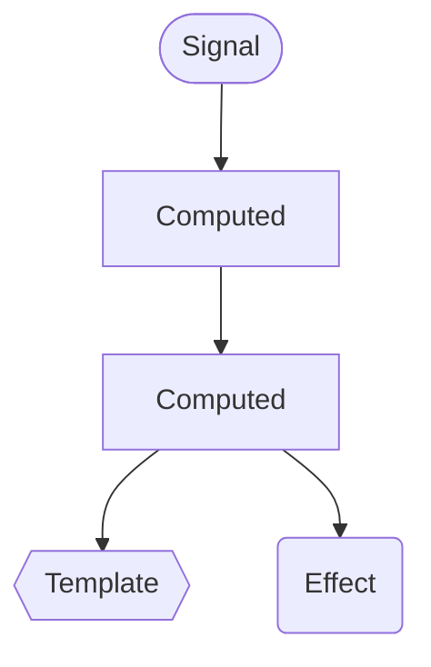

<h1 flex flex-col items-center forward:delay-400 text-transparent text-center important-text-5xl font-800 important-leading-1.2em style="background: -webkit-linear-gradient(315deg,#E43348 25%,#972FF2);-webkit-background-clip: text;">

 Angular Deliver web apps with confidence
</h1>

---
layout: cover
---

# Sharing an observation

<v-click>

## Enthusiam around Angular is raising
</v-click>

---
layout: center
---

<!-- https://x.com/theo/status/1861999758291910660 -->

---
layout: cover
title: Life-cycle hook free
---

<h1 flex="~ col">

  Modern 
  Angular
  ❤️

Building reactivity

</h1>

  

  NG Venice
  

  
March 14th 2025

<!--

...

[click] ...
-->

---
layout: intro
class: pl-20
glowSeed: 14
---

# Matthieu Riegler

*]:important-leading-10 opacity-80">

🧑🏼‍💻 Software Engineer 
🚂 Random dude who often codes on the train  
{Angular} Team / OSS  

<!-- TODO FULLTIME-->

  

  
<a href="https://riegler.fr" target="_blank" class="border-none! font-300">riegler.fr</a>

  

  
<a href="https://www.linkedin.com/in/matthieuriegler/" target="_blank" class="border-none! font-300">Matthieu&nbsp;Riegler</a>

  

  
<a href="https://github.com/JeanMeche" target="_blank" class="border-none! font-300">JeanMeche</a>

  

  
<a href="https://bsky.app/profile/jeanmeche.com" target="_blank" class="border-none! font-300">jeanmeche.com</a>

  

  
<a href="https://twitter.com/jean__meche" target="_blank" class="border-none! font-300">jean__meche</a>

<!--
So first, let me introduce myself, my name is Matthieu Riegler.

...
-->

---
layout: intro
class: text-center pb-5
---

# How we arrived here

<v-click>

## Angular Renaissance
</v-click>

---
class: center
---

# Angular Renaissance
  

<v-click>

*  Rich in features
</v-click>
  
<v-click>

* Rich in simplications
</v-click>

---
layout: fact
---

First, a step back.

<v-click>

# Ivy

</v-click>

<!-- Ivy enabled to do a lof of innovations in Angular -->

---
layout: fact
---

# Standalone

---
layout: center
---

---
layout: center
---

<!-- https://x.com/synalx/status/1882879962547659078 -->

---

# Angular Renaissance

* Standalone components

* Typed Forms

* Host Directives

* Control Flow syntax (`@if`/`@for`/`@switch`)

* Deferred loading (`@defer`)

* SSR / Hydration

---
class: flex flex-col
---

# Renaissance

<!-- https://x.com/sarah_edo/status/1628065696247857152 -->

---
layout: cover
---

# Signals,  a new reactivity model

---
layout: fact
---

# What's reactivity ?

  
  
  

---
layout: cover
---

# The need for a new model

<v-click>

## To replace zone.js

</v-click>

---

# Zone.js

* Tells Angular when something has change

* Angular synchronize the data and the DOM

---

# Downsides of Zone.js

*  30Kb of eagerly loaded library

* Monkey patches browser APIs (global side effects)

* Runtime context (Zones)

* Messy stacktraces

* No support for native Async/Await

---
layout: cover
---

# Poor DX

# Performance footguns

<!--
Basically holding us back
-->

---
layout: cover
---

# Engineering problem

## Complexe vs Complicated

---

  <h1>Complicated</h1>

  * Takes time ⏳

  * Follow the plan 📖

  <h1>Complex</h1>

  * Like a plate of 🍝

  * Entangled 🪢

  * Relationships

  * Unknown outcome ❓

<!--
Complicated: Like building a plane

Complex:
En y plantant sa fourchette, il est très difficile de prévoir combien de pâtes on va attraper et quelle va être la forme de celles qui resteront dans l’assiette
-->

---

# Ideas

* Improving zone.js
* setState-style APIs
* Signals
* RxJS
* Compiler-based reactivity
* Proxies

---
layout: cover
---

# Getting inspired

## We like good ideas

<!-- We don't have the monopoly on good ideas -->

---

# We like the good parts

<!-- https://x.com/synalx/status/1720509219752017949 -->

---
layout: cover
---

# Signals

## Inspired by Preact, Vue & SolidJS

<a absolute bottom-8 href="https://dev.to/this-is-learning/the-evolution-of-signals-in-javascript-8ob/?utm_source=chatgpt.com">Blog: Evolution of Signals by Ryan Carniato</a>

<!--
During our research, one reactivity model stood out as clearly meeting our requirements while offering a very natural developer experience: signals.
-->

---
layout: 'intro'
---

# Signals
## A new reactive primitive

* Know when they're read
* Know when they're mutated

---

# v16 - First primitives

* `signal()`

* `computed()`

* `effect()`

---
layout: fact
---

<h1>4 RFCs </h1>

<h2 v-click>Feedback matters</h2>

<!--
1. Signal for reactivity
2. Signal APIs
3. Signal Components
4. RxJS Interop
-->

---
layout: cover
---

# Signal graph

### ➡️ Angular understands the signal graph
 

### ➡️ 2-way data flow (👋 NG0100)
 

### ➡️ Enabled optimizations

---
layout: cover
---

# Zoneless is actually  it's own topic

<v-click>

## Possible with RxJS + `AsyncPipe`
</v-click>

---
layout: cover
---

# Expanding reactivity

## signal inputs, model & view queries

---
layout: cover
---

# Real life experience  for the team

## Google Fonts App

---

# Collected experience

* Need for an automatic migration to close the gap

* `effect()`-based pattern

---
layout: cover
---

# `effect()` bad

---
layout: cover
---

# We needed new primitives

## `linkedSignal()`
 

* Writable state
* Sync'd with other signals
* Previous value

## Advanced derivation

---
layout: cover
---

## Synchronous Derivation with `computed`/`linkedSignal`

  
<v-click>

## We still need something for async derivation !
</v-click>

---
layout: fact
---

# Resource

<v-click>

## New strategy: Experiental
</v-click>

---
layout: intro
---

# Experimental

## Basically feature that will change

## `resource` / `rxResource`
   

## Play with it for a few months  Give us constructive feedback in an RFC

---

# Resource

---
layout: intro
class: text-center pb-5
---

# Thank you!

Slides on [riegler.fr/talks](https://riegler.fr/talks)

<!--
That's all for my talk, thank you. Please enjoy the rest of the conference :)
-->
