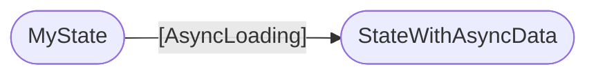

<h1 flex flex-col items-center forward:delay-400 text-transparent text-center important-text-5xl font-800 important-leading-1.2em style="background: -webkit-linear-gradient(315deg,#E43348 25%,#972FF2);-webkit-background-clip: text;">

<br>Angular<br>Deliver web apps with confidence
</h1>

---
layout: cover
---

# Sharing an observation

<v-click>

## Enthusiam around Angular is raising
</v-click>

---
layout: center
---

<div w-136>


<!-- https://x.com/theo/status/1861999758291910660 -->
</div>

---
layout: cover
title: Life-cycle hook free
---

<h1 flex="~ col">
<div text-2xl origin-top-left transition duration-500 :class="$clicks <= 2 ? 'scale-150' : 'op50'">
  <span v-click>Modern </span>
  <span>Angular</span>
  <sup v-click>❤️</sup>
</div>
<div mt1 forward:delay-300 v-click>Building reactivity</div>
</h1>

<div abs-br mx-10 mb-35 flex="~ col gap-4 items-end" text-left v-click="1">
  

<div flex flex-col items-center forward:delay-400 text-transparent text-center important-text-5xl font-800 important-leading-1.2em style="background: -webkit-linear-gradient(315deg,#E43348 25%,#972FF2);-webkit-background-clip: text;">
  NG Venice
  </div>
  <div text-sm opacity-75 mt--4>March 14th 2025</div>
</div>

<!--

...

[click] ...
-->

---
layout: intro
class: pl-20
glowSeed: 14
---

# Matthieu Riegler

<div class="[&>*]:important-leading-10 opacity-80">

🧑🏼‍💻 Software Engineer<br>
🚂 Random dude who often codes on the train <br>
{Angular} Team / OSS <br>

<v-click>
 🚀 Now working full time on Angular & Tooling
</v-click>
</div>

<div my-10 w-min flex="~ gap-1" items-center justify-center v-click>
  <div i-ri-user-3-line op50 ma text-xl />
  <div><a href="https://riegler.fr" target="_blank" class="border-none! font-300">riegler.fr</a></div>
  <div i-ri-linkedin-line op50 ma text-xl ml4/>
  <div><a href="https://www.linkedin.com/in/matthieuriegler/" target="_blank" class="border-none! font-300">Matthieu&nbsp;Riegler</a></div>
  <div i-ri-github-line op50 ma text-xl ml4/>
  <div><a href="https://github.com/JeanMeche" target="_blank" class="border-none! font-300">JeanMeche</a></div>
  <div i-ri-bluesky-line op50 ma text-xl ml4 />
  <div><a href="https://bsky.app/profile/jeanmeche.com" target="_blank" class="border-none! font-300">jeanmeche.com</a></div>
  <div i-ri-twitter-x-line op50 ma text-xl ml4/>
  <div><a href="https://twitter.com/jean__meche" target="_blank" class="border-none! font-300">jean__meche</a></div>
</div>


<!--
So first, let me introduce myself, my name is Matthieu Riegler.

...
-->

---
layout: intro
class: text-center pb-5
---

# How we arrived here

<v-click>

## Angular Renaissance
</v-click>

---
class: center
---

<div grid="~ cols-2 gap-10" h-full font-size-8>

<div flex flex-col>
<div>

# Angular Renaissance
<br><br>

<v-click>

*  Rich in features
</v-click>
<br><br>
<v-click>

* Rich in simplications
</v-click>
</div>
</div>

{.rounded-lg.shadow.border.border-main.m-auto}

</div>

---
layout: fact
---

First, a step back.

<v-click>

# Ivy

</v-click>

<!-- Ivy enabled to do a lof of innovations in Angular -->

---
layout: fact
---

# Standalone

---
layout: center
---

{.rounded-lg.shadow.border.border-main.m-auto}

---
layout: center
---

<div w-136>


<!-- https://x.com/synalx/status/1882879962547659078 -->
</div>

---

# Angular Renaissance

* Standalone components

* Typed Forms

* Host Directives

* Control Flow syntax (`@if`/`@for`/`@switch`)

* Deferred loading (`@defer`)

* SSR / Hydration

---
layout: cover
---

# What is the most impactful change we can do to the framework ?

<!--
How can we futureproof the framework

and make angular part of the new
generation of frameworks
-->

---
class: flex flex-col
---

# Renaissance

<div w-136 v-click m-auto>


<!-- https://x.com/sarah_edo/status/1628065696247857152 -->
</div>

<!--
Sarah

Senior Director of Engineering
-->

---
layout: cover
---

# Signals,<br> A new reactivity model

---
layout: fact
---

# What's reactivity ?

<div flex gap-24 justify-center mt-24 v-click>
  
  
  
</div>

---
layout: cover
---

# The need for a new reactivity model

<v-click>

## To replace zone.js

</v-click>

---
layout: cover
---

# Zone.js

* Tells <span i-devicon-angular inline-block scale-110 translate-y-0.5 ml-1 /> Angular when something has change

* Angular synchronize the data and the DOM

---
layout: cover
---

# Downsides of Zone.js

*  30Kb of eagerly loaded library

* Monkey patches browser APIs (global side effects)

* Those patched API will trigger change cycles

* Runtime context (Zones)

* Messy stacktraces

* No support for native Async/Await

---
layout: cover
---

# Poor DX

# Performance footguns

<!--
Basically holding us back
-->

---
layout: cover
---

# Engineering problem

<v-click>

## Complexe vs Complicated
</v-click>

---

# Complexe vs Complicated

<div grid="~ cols-2 gap-10" mt-16 h-full text-4xl>
<v-clicks>
<div>
  <h2>Complicated</h2>

  * Takes time ⏳

  * Follow the plan 📖
</div>

<div>
  <h2>Complex</h2>

  * Like a plate of 🍝

  * Entangled 🪢

  * Relationships

  * full of uncertainty and contradictions.

  * Unknown outcome ❓

</div>

</v-clicks>
</div>
<!--
Complicated: Like building a plane

Complex:
En y plantant sa fourchette, il est très difficile de prévoir combien de pâtes on va attraper et quelle va être la forme de celles qui resteront dans l’assiette
-->

---
layout: cover
---

# Ideas

* Improving zone.js
* setState-style APIs
* Signals
* RxJS
* Compiler-based reactivity
* Proxies

---
layout: cover
---

# Getting inspired

## We like good ideas

<!-- We don't have the monopoly on good ideas -->

---

# We like the good parts

<div w-136 m-auto mt-12>


<!-- https://x.com/synalx/status/1720509219752017949 -->
</div>

---
layout: cover
---

# Signals

## Inspired by Preact, Vue & SolidJS

<a absolute bottom-8 href="https://dev.to/this-is-learning/the-evolution-of-signals-in-javascript-8ob/?utm_source=chatgpt.com">Blog: Evolution of Signals by Ryan Carniato</a>

<!--
During our research, one reactivity model stood out as clearly meeting our requirements while offering a very natural developer experience: signals.
-->

---
layout: 'intro'
---

# Signals
## A new reactive primitive

* Know when they're read : `mySignal()`
* Know when they're mutated : `mySignal.set()` / `mySignal.update()`

---
layout: cover
---

# v16 - First primitives

* `signal()`, defines a signal

* `computed()`, defines a derivation

* `effect()`, schedules a callback on changes

---
layout: fact
---

<h1><span v-click>4</span> RFC<span v-click="1">s</span> </h1>

<h2 v-click>Feedback matters</h2>

<!--
1. Signal for reactivity
2. Signal APIs
3. Signal Components
4. RxJS Interop
-->

---
layout: cover
---

# Signal graph

<div grid="~ cols-2 gap-10" h-full font-size-8>

<div v-click>


</div>
<div v-click>

### ➡️ Angular understands the signal graph
<br>

### ➡️ 2-way data flow (👋 NG0100)
<br>

### ➡️ Enables perf optimizations
</div>
</div>

---
layout: cover
---

# Zoneless is actually<br> it's own topic

<v-click>

## Possible with RxJS + `AsyncPipe`
</v-click>

---
layout: cover
---

# Expanding reactivity

## `input()`, `model()` & view queries (`viewChild`, `contentChild` etc.)

<v-click>

{.w-100.rounded-lg.shadow.border.border-main.mt-12}
</v-click>

---
layout: cover
---

# Real life experience<br> for the team

## Google Fonts App

---
layout: cover
---

# Collected experience

* Need for an automatic migration to close the gap

* `effect()`-based pattern

* Bonus: Made the app Zoneless

---
layout: cover
---

# `effect()` bad

<span></span>
<v-clicks>

{.w-500px.rounded-lg.shadow.border.border-main.absolute.rotate-15.top-35.left-60}

{.w-500px.rounded-lg.shadow.border.border-main.absolute.rotate--15.top-25.left-60}

{.w-600px.rounded-lg.shadow.border.border-main.absolute.rotate-15.top-35.left-50}
</v-clicks>

---
layout: cover
---

# We needed new primitives

## `linkedSignal()`
<br>

* Writable state
* Sync'd when source signals change
* Previous value

## Advanced derivation

---
layout: cover
---

## Synchronous Derivation with `computed`/`linkedSignal`

<br><br>
<v-click>

## We still need something for async derivation !
</v-click>

---
layout: cover
---

# What asynchrony entails

## Designing APIs for Asynchrony

---
layout: center
class: large-code
---

# Observables <span v-click=3> are both <span text-lime italic>sync</span> & <span text-purple italic>async</span> !</span>

````md magic-move
```ts
myObservable = myService.getSomethingAsync();

myObservable.subscribe(console.log);
```
```ts
myObservable = myService.getSomethingAsync();

// If it's a Http Request, it'll be async
myObservable.subscribe(console.log);
```
```ts
myObservable = myService.getSomethingAsync();

// If it's a Http Request, it'll be async
myObservable.subscribe(console.log);

// If it's a replay subject, It could be sync
myObservable.subscribe(console.log);
```
````

---
layout: cover
---

> If you have an API which takes a callback,
>
> and sometimes that callback is called <u>immediately</u>,
>
> and other times that callback is called <u>at some point in the future</u>,
>
> then you will render any code using this API impossible to reason about, and cause the release of <b>**Zalgo**</b>.

<style>
blockquote {
  font-size: 24px;
  line-height: 24px;
  p {
    margin: 8px 0;
  }
}
</style>

<a absolute bottom-8 href="https://blog.ometer.com/2011/07/24/callbacks-synchronous-and-asynchronous/">Callbacks, synchronous and asynchronous, by Havoc</a>

---
layout: center
class: large-code
---

# To avoid the release of Zalgo

```js
let after = false;
callbackTaker(() => {
  assert(after === true); // Async
});
after = true;
```

OR

```js
let after = false;
callbackTaker(() => {
  assert(after === false); // Sync
});
after = true;
```

<!-- In other words, to avoid the release of Zalgo, exactly one of the following must be true: -->

---
class: flex flex-col
---

# Release of Zalgo

<div flex justify-center m-auto text-4xl>
,̴͇̺͖̥̔̄̐̅͐̑̑̈́̅̍͑̽̽͋̒̀ ̴̡̨̟͖̹͔͙̰͙̔H̵̨̛̹͍̳͚͙͚̗̹̙̘͌̿̉̏̂͒̽̈́̈̀̇͐̐̚͝e̸͕͇̯̦̳̳̝̲̬̳̳̤̺͙̽̎͊͑̉͊̑͠ ̵̼͈̻̫͙̱̳̱̜̞͖̆͒͂̋̾͆́̾̈̆̐͝͝͝w̵͔̾̈́̈́́͛͛́̒̈̕̚͝͝h̶̫͉͇̹͙͍̪̉o̸͕̟͖̮̎͂̓̇͛̈́̋́͌͆̀̔̈́ ̷̳̌̍͋̓̄̉̒̂ó̶͓̜͌̀̾̆̄n̵̢̡̛̛̻͖͍̻͇̹̥̞͔̼̝̹͖̙̎̈́͊͋͗̿̓͑̐ͅl̸̛̪̗̮͖͂̉̄́̓̐͑̊͋̽̕͘͠y̶̢̳̯̞̲̠̻̲͙̜̱̆͊̈́̃͆̀̑͌̉ͅ ̴̧̡̢̨̙̪͇͉̤̭̱͐̾͋̑̾̑̊͊̈́̃̚͝p̴̦̪̱̂̑́͒̈́̍̍̀́͛͘̚͠͝r̸̜̖̍̂̉͒͛̌̅̽o̵̢̞̪̗̥͈̻͈̙̭̱̦͖̤̟͒̈́͊m̸̥͖͊͗̃̅̉̇͛̅̐͗͆͂̇̆̕͝i̷̟̞̲͙̰̋͛̓̐̂͊̀̑͗͠s̸͔̟̙͗̉̇̈́̉͗͊͝ę̵̡̙͖̳͚̫̟͇͙̺́̍͆̅̀͑̋̃̈́̌̈̾͠ͅş̴̛̛͇̳̘͋̌̅͆̓̀̈́̈́̂̎͘͠ ̶̨̛̦̬͓̖̪̪̞̩̥̾̉͐͊̍m̸̡͈̦͓̞͎̟̼̠̱̝̪̄͘a̴̪̻̥͎͚͇̯͚̞̙̤̳̔ḑ̵̲̻̼͔̍̉͗̈͝n̸̡̗̱͕̠̬̼̠̞̪̱͇̣̄̆͜ͅë̶̛͇̭̖́̑̂̓̐̐͑͘ş̷̢̨̹̝͊́̒͐s̶̨̡̖̻̦̦͙̭̬̝͎̹̍͊̉̏̌̀͑̐̓͝
</div>

---
layout: cover
---

# Async APIs do not go faster.<br>They go slower.

## Our Async signal should be ... synchronous !

---
layout: fact
---

# Resource

<v-click>

## New strategy: Experiental
</v-click>

---
layout: intro
---

# Experimental

## Basically features that will change/evolve a bit
<br>

## `resource()` / `rxResource()` / `httpResource()`
<br><br><br>
<div v-click>

## Play with it for a few months<br><br>Give us constructive feedback in an RFC
</div>

---

# Resource

* Always has a synchronous value (could be `undefined`)
* Status flag
* Reactivity

## Today, it's for build asynchronous derivation

<style>
  ul { margin-top: 12px; }
  li { margin: 4px 0; font-size: 24px; }
</style>

---
layout: center
---

# Resource



---
layout: center
---

# APIs

```ts {*}{class:'!children:text-xl'}
resource({
  request: () => { /* signals to return params  */ }
  loader: (params) => { /* async load with the params */}
});

rxResource({
  request: () => { /* signals to return params */}
  loader: (params) => { /* observable with the params */}
})

httpResource(() => `https://swapi.dev/api/people/${peopleId()}`)
```

---
layout: fact
---

# Declarative

---
layout: cover
---

# What about sending data ? 🤔

<v-click>

## I want to send my form 📋 !!!!
</v-click>

---

{.w-800.rounded-lg.shadow.border.border-main.m-auto}

<h1 v-click pt-8>At least not for now </h1>

---
layout: cover
---

<style>
h1 { font-size: 48px !important; }
</style>

<h1> Overall picture might not be complete</h1>
<br><br><br><br>
<h1 v-click>The data loading "story" is incomplete</h1>

---
layout: fact
---

# There is more.

<v-click>

## Angular understand the signal graph
</v-click>

---
layout: cover
---

# Perspectives

* Blocking and non-blocking data dependencies ?

* Prefetching data dependencies

* Resource streaming from SSR

---
layout: cover
---

* Template API for awaiting data

---
layout: fact
---

# Please give us your feedback on the RFC

## Open til then end of the month

---
layout: intro
class: text-center pb-5
---

# Thank you for being such a great community 🙌

Slides on [riegler.fr/talks](https://riegler.fr/talks)

<!--
That's all for my talk, thank you. Please enjoy the rest of the conference :)
-->
